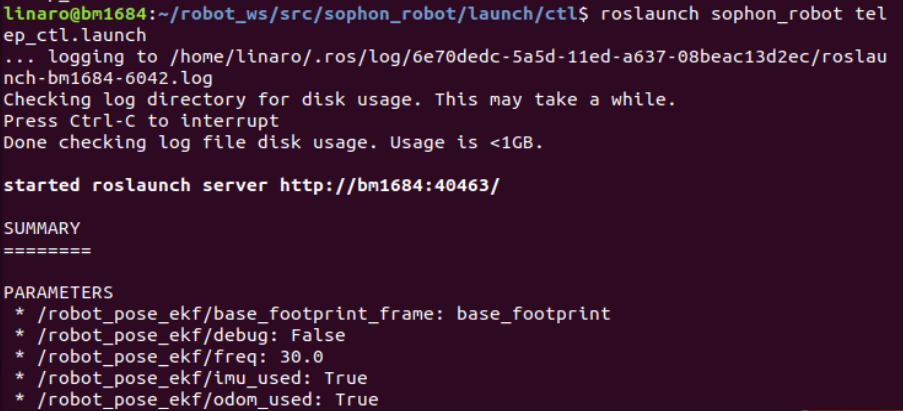

## 1 智能车移动控制
给小车下位机和雷达提升权限（可先通过ls -l /dev/ttyUSB*查看权限，若都是crwxrwxrwx则可以跳过这一步）
```
sudo chmod 777 /dev/ttyUSB0
sudo chmod 777 /dev/ttyUSB1
```
启动机器人主节点
```
roscore
```


启动机器人底盘移动节点
```
roslaunch sophon_robot kt1001.launch
```


启动机器人键盘控制节点
```
roslaunch sophon_robot telep_ctl.launch
```


此时可以使用上下键控制机器人移动，在机器人终端接受的话题中可以看见数据
```
rostopic echo /cmd_vel
```


## 3 移动控制代码实现
所有功能源代码均可在~/robot_ws/sophon_robot/src/scripts目录下找到

首先创建两个词典，其中moveBindings用于存储小车的方向键绑定，speedBindings用于存储速度键绑定
```bash
moveBindings = {
        'i':(1,0,0,0),
        'o':(1,0,0,-1),
        'j':(0,0,0,1),
        'l':(0,0,0,-1),
        'u':(1,0,0,1),
        ',':(-1,0,0,0),
        '.':(-1,0,0,1),
        'm':(-1,0,0,-1),
        'O':(1,-1,0,0),
        'I':(1,0,0,0),
        'J':(0,1,0,0),
        'L':(0,-1,0,0),
        'U':(1,1,0,0),
        '<':(-1,0,0,0),
        '>':(-1,-1,0,0),
        'M':(-1,1,0,0),
        't':(0,0,1,0),
        'k':(0,0,0,0),
        ' ':(0,0,0,0),
        'b':(0,0,-1,0),
        'A':(1,0,0,0),
        'B':(-1,0,0,0),
        'C':(0,0,0,-1),
        'D':(0,0,0,1),
    }

speedBindings={
        'q':(1.1,1.1),
        'z':(.9,.9),
        'w':(1.1,1),
        'x':(.9,1),
        'e':(1,1.1),
        'c':(1,.9),
    }
```
启动launch脚本后，使用getkeys()函数获得键盘的输入信息
```bash
def getKey():
    tty.setraw(sys.stdin.fileno())
    select.select([sys.stdin], [], [], 0)
    key = sys.stdin.read(1)
    termios.tcsetattr(sys.stdin, termios.TCSADRAIN, settings)
    return key
```

根据读取的的按键在两个字典中遍历，判断该按键是用于改变方向还是速度，然后在相应的字典里中读取方向信息或者速度信息，用于后续发布给底盘节点。
```bash
try:
print(msg)
print(vels(speed,turn))
while(1):
    key = getKey()
    #print("%s"%(key))
    if key in moveBindings.keys():
        x = moveBindings[key][0]
        y = moveBindings[key][1]
        z = moveBindings[key][2]
        th = moveBindings[key][3]
        twist = Twist()
        twist.linear.x = x*speed; twist.linear.y = y*speed; twist.linear.z = z*speed;
        twist.angular.x = 0; twist.angular.y = 0; twist.angular.z = th*turn
        pub.publish(twist) #publish cmd_vel topic
    elif key in speedBindings.keys():
        speed = speed * speedBindings[key][0]
        turn = turn * speedBindings[key][1]

        print(vels(speed,turn))
        if (status == 14):
            print(msg)
        status = (status + 1) % 15
    else:
        x = 0
        y = 0
        z = 0
        th = 0
        if (key == '\x03'):
            break
```
