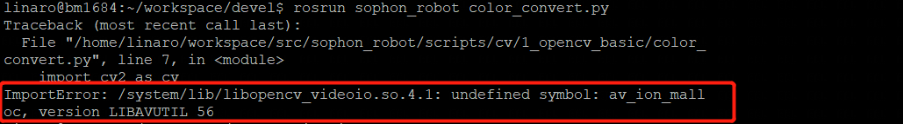
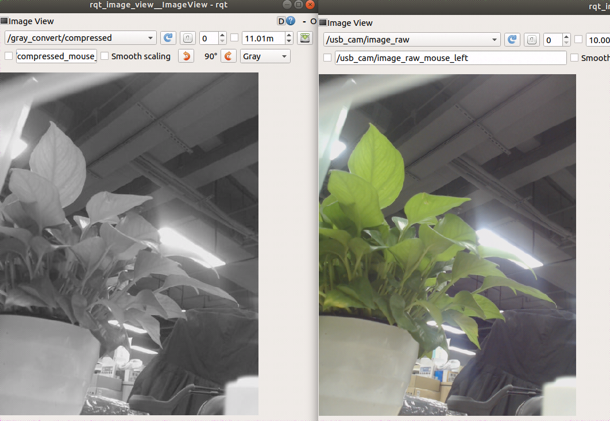
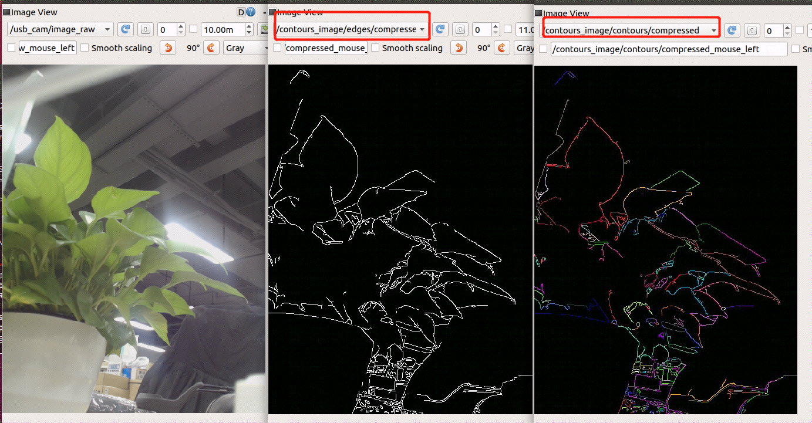
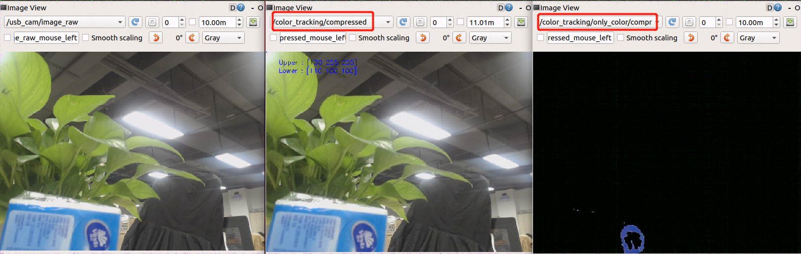
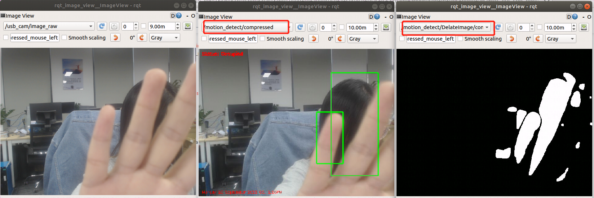
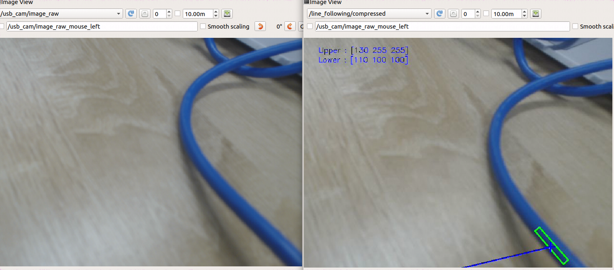
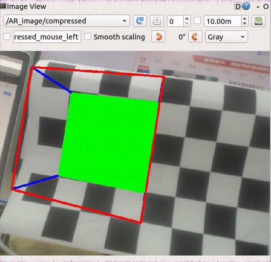
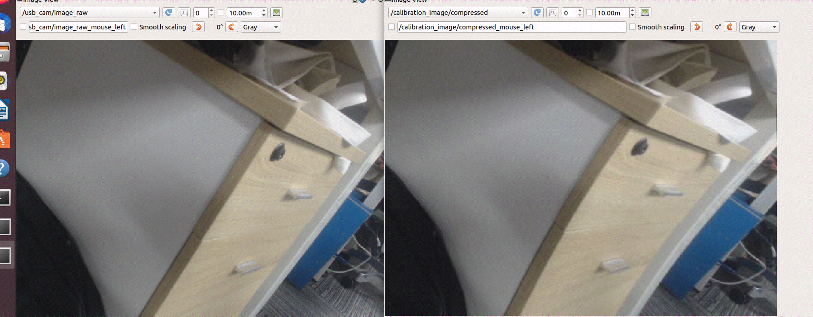

ROS无法直接进行图像处理，需要借助于opencv，要使用cv_bridge把ROS 的图像数据格式转为Opencv可以使用的数据格式。即是一个提供ROS和OpenCV库提供之间的接口的开发包。然后可以将opencv处理好的图像再转换回ros中的数据格式。 


##  SE5端运行摄像头节点

```bash
sudo chmod 777 /dev/video0
roslaunch usb_cam usb_cam-test.launch
```

如下图显示，摄像头节点启动成功


## 灰度图变换

将彩色图像转化成为灰度图像的过程称为图像的灰度化处理， 彩色图像中的每个像素的颜色有R、G、B三个分量决定，而每个分量有255中值可取。而灰度图像是R、G、B三个分量相同的一种特殊的彩色图像，其一个像素点的变化范围为255种，所以在数字图像处理种一般先将各种格式的图像转变成灰度图像以使后续的图像的计算量变得少一些。灰度图像的描述与彩色图像一样仍然反映了整幅图像的整体和局部的色度和亮度等级的分布和特征。

另外起一个se5终端，运行color_convert.py

```
rosrun sophon_robot color_convert.py
```

如果遇到以下问题，需要重新设置环境变量

```
export PATH=$PATH:/system/bin
export LD_LIBRARY_PATH=$LD_LIBRARY_PATH:/system/lib/:/system/usr/lib/aarch64-linux-gnu
export PYTHONPATH=$PYTHONPATH:/system/lib
```



打开虚拟机终端，输入以下命令启动ros节点

```
roscore
```

打开一个新的虚拟机终端，执行下面命令，打开一个图像查看界面，查看灰度图变换话题

```bash
rosrun rqt_image_view rqt_image_view
```

如下图显示，左边是经过灰度图变换的图像，右边是没有经过灰度变换的图像




## 边缘检测

边缘检测是图像处理技术，用于确定图片中物体的边界（边缘）或者区域。边缘是图像中重要的特征。我们通过边缘来了解图像的结构信息。边缘检测是图像处理和计算机视觉中的基本问题，边缘检测的目的是标识数字图像中亮度变化明显的点。

另外起一个se5终端，运行contours.py 

```
rosrun sophon_robot contours.py
```

打开一个新的虚拟机终端，执行下面命令，打开一个图像查看界面，查看边缘检测话题

```
rosrun rqt_image_view rqt_image_view
```

如下图显示，左边图像是原始图像，中间图像寻找原始图像的轮廓并显示，右边图像为轮廓添加彩色动感效果



## 颜色变换,识别出画面中蓝色的区域

另外起一个se5终端，运行color_tracking.py

```
rosrun sophon_robot color_tracking.py
```

打开一个新的虚拟机终端，执行下面命令，打开一个图像查看界面，查看颜色变换话题

```
rosrun rqt_image_view rqt_image_view
```

如下图显示，左边图像是原始图像，中间图像检测图像中的蓝色，右边图像将画面中蓝色的区域单独过滤显示



## 人脸检测

人脸检测需要在输入的图像中确定人脸（如果存在）的位置、大小 和姿态，往往用于生物特征识别、视频监听、人机交互等应用中。

2001 年，Viola 和 Jones提出了基于Haar特征的级联分类器对象检测算法，并在2002年由Lienhart和Maydt进行改进，为快速、可靠的人脸检测应用提 供了一种有效方法。OpenCV已经集成了该算法的开源实现，利用大量样本的Haar特征进行分类器训练，然后调用训练好的瀑布级联分类器 cascade进行模式匹配。

另外起一个se5终端，运行face_detect.py

```
rosrun sophon_robot face_detect.py
```

打开一个新的虚拟机终端，执行下面命令，打开一个图像查看界面，查看人脸检测话题

```
rosrun rqt_image_view rqt_image_view
```

程序运行后将在图像中检测人脸，当检测到人脸后将用绿色方框显示出人脸位置


##  动作检测，移动区域定位

动作检测首先根据输入的图像流和选择跟踪的物体，采样物体在图像当前帧中的特征点；然后将当前帧和下一帧图像进行灰度值比较，估计出当前帧中跟踪物体的特征点在下一帧图像中的 位置；再过滤位置不变的特征点，余下的点就是跟踪物体在第二帧图像中的特征点，其特征点集群即为移动区域的位置。

另外起一个se5终端，运行motion_detect.py

```bash
#安装motion_detect.py导入的包imutils
pip3 install imutils

rosrun sophon_robot motion_detect.py
```

打开一个新的虚拟机终端，执行下面命令，打开一个图像查看界面，查看动作检测话题

```bash
rosrun rqt_image_view rqt_image_view
```

如下图显示，左边图像是原始图像，中间图像中看到矩形框标识出了运动物体的实时位置，右边图像显示运动物体的残影



## 视觉巡线

本代码是巡蓝线，\+ 表示识别图像的中心位置，后面配合小车底盘，根据图中蓝线斜率调节小车角速度实现巡线效果

另外起一个se5终端，运行line_follow.py 

```
rosrun sophon_robot line_follow.py
```

打开一个新的虚拟机终端，执行下面命令，打开一个图像查看界面，查看视觉巡线话题

```
rosrun rqt_image_view rqt_image_view
```



##  角点检测，3d模型生成

角点检测(Corner Detection)是计算机视觉系统中用来获得图像特征的一种方法，也称为特征点检测，广泛应用于运动检测、图像匹配、视频跟踪、三维建模和目标识别等领域中。

另外起一个se5终端，运行pose.py 

```
rosrun sophon_robot pose.py
```

打开一个新的虚拟机终端，执行下面命令，打开一个图像查看界面，查看角点检测话题

```
rosrun rqt_image_view rqt_image_view
```

如下图显示，程序运行后将检测棋盘纸，并在棋盘纸上显示一个立方体，棋盘纸移动立方体也跟着移动



##  相机参数矫正，后图像展示

畸变是相机因其自身成像特性无法避免产生的图像变形。通过camera_info相机信息话题数据校准摄像头图像，运行此程序前需要先校准摄像头。

另外起一个se5终端，运行calibration.py 

```
rosrun sophon_robot calibration.py 
```

打开一个新的虚拟机终端，执行下面命令，打开一个图像查看界面，查看相机参数矫正话题

```
rosrun rqt_image_view rqt_image_view
```


