我们使用市面上最常用的USB摄像头为例为SE5提供视觉识别功能。
首先，将USB摄像机通过usb和SE5进行连接。 然后在SE5终端，查询usb是否连接，执行下面命令。

   ```
lsusb 
   ```

如下图显示，可以看到设备Webcam，表明USB摄像机与SE5连接成功

   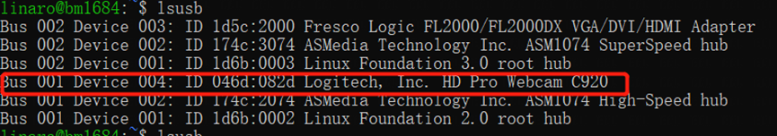


### 1 SE5安装usb_cam软件包   

要想USB摄像头在ROS下正常运行，需要一个软件包进行支持。usb_cam是ROS系统下最常用的摄像头软件包，可以理解为V4L(Video for Linux)摄像头驱动在ROS下移植的一个版本。下面介绍两种安装方式（以下两种方式选择一种方式安装即可）

   ### 第一种方法：通过简单的apt-get进行安装

这种安装方式适用于不需要对usb_cam软件包进行深度定制，直接在SE5终端输入

   ```bash
sudo apt-get install ros-noetic-usb-cam
   ```

如下图显示，usb_cam安装成功

   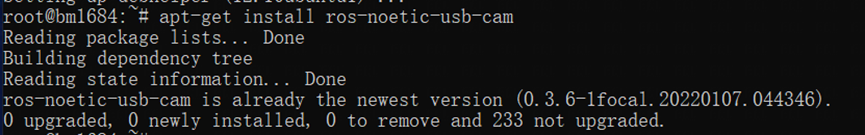

   ### 第二种方法：源码安装方式

这种方式适用于需要对usb_cam进行深度定制修改的情形。
新建一个工作目录catkin_ws/src，在carkin_ws/src下面克隆usb_cam的源码

   ```bash
cd data
mkdir catkin_make
cd catkin_make
mkdir src
cd src
git clone https://github.com/ros-drivers/usb_cam.git
cd ..
catkin_make
cd /data/catkin_make/devel
source setup.bash
   ```

如下图 usb_cam安装成功

   

 ### 2 SE5启动usb摄像头节点

 打开SE5终端，输入下面的命令启动ros节点

   ```bash
roscore
   ```

 打开一个新的SE5终端，在SE5终端中输入下面的命令，就可以启动摄像头节点。

   ```bash
sudo chmod 777 /dev/video0
roslaunch usb_cam usb_cam-test.launch
   ```

 如下图显示，摄像头节点启动成功

   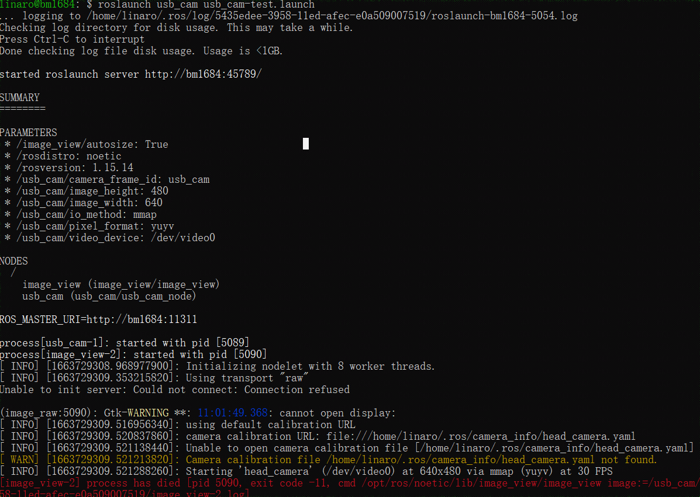


 ### 3 虚拟机启动图像查看界面

打开虚拟机终端，输入下面的命令启动ros节点

   ```bash
roscore
   ```

打开一个新的虚拟机终端，执行下面命令，就可以打开一个图像查看界面。

   ```bash
rosrun rqt_image_view rqt_image_view
   ```

如下图显示，可以在虚拟机看到摄像头中的图像

   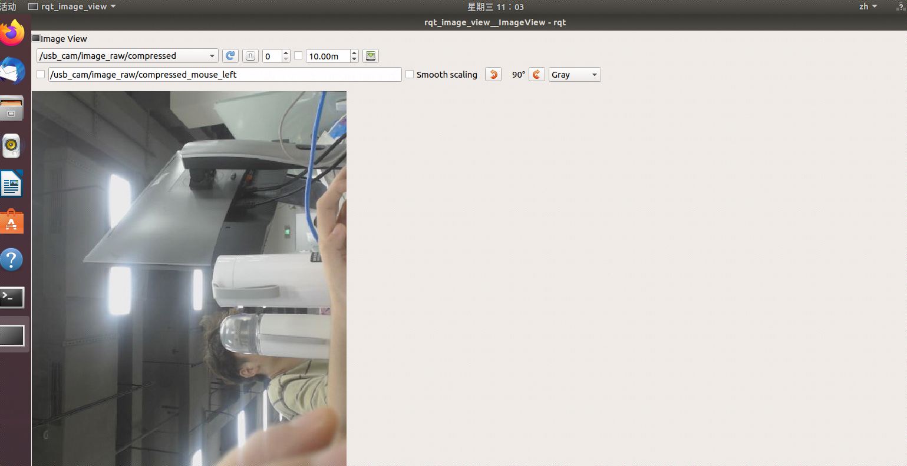

 ### 4 虚拟机通过RVIZ查看图像

打开一个新的虚拟机终端，运行下面命令

   ```bash
rviz
   ```

虚拟机打开rviz，如下图添加image话题 

   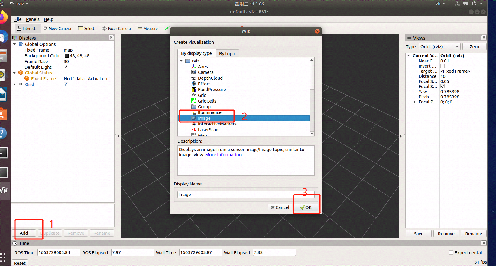

 如下图选择 image/topic 为 /usb_cam/image_raw

   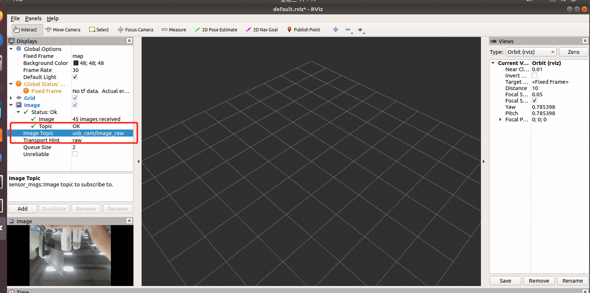

### 5 摄像头校准

打开一个新的虚拟机终端，运行下面命令

   ```bash
rosrun camera_calibration cameracalibrator.py --size 5x7 --square 0.03 image:=/usb_cam/image_raw camera:=/usb_cam
   ```

如下图所示，手持棋盘格标定图纸，将其完全放到摄像机画面中

   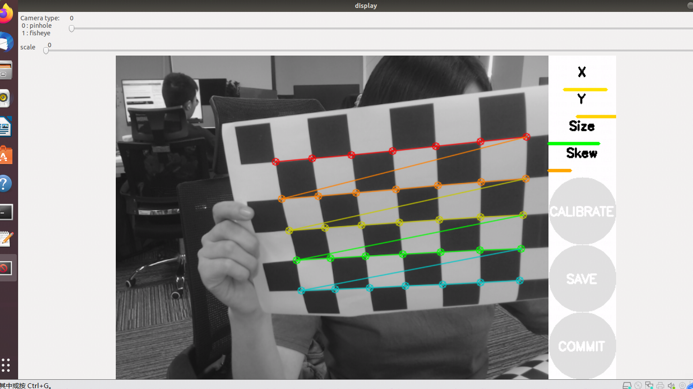

为了获得更好的校准效果，需要将棋盘格移动到图像不同的位置中，特别是图像的边缘位置。
如下图，当CALIBRATE按钮由灰色变成绿色时，表示数据已经采集足够数据，可以单击CALIBRATE查看结果，如下图显示

   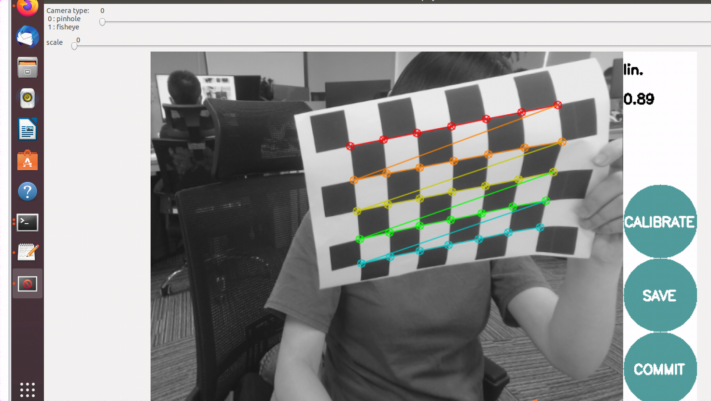

点击"CALIBRATE "按键,校准程序自动计算校准参数，需要等待一点时间，界面可能会变成灰色无响应状态，注意不要关闭耐心等待一会即可
点击"SAVE"可以将校准资料保存到虚拟机的临时文件中，点击"COMMIT"可以保存校准文件到SE5配置文件中，如下图是CALIBRATE的校准结果

   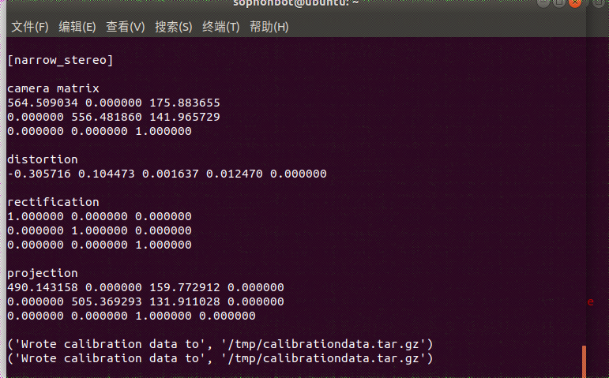

如上图显示，校准资料保存在虚拟机的/tmp/calibrationdata.tar.gz下，解压后，如下图显示

   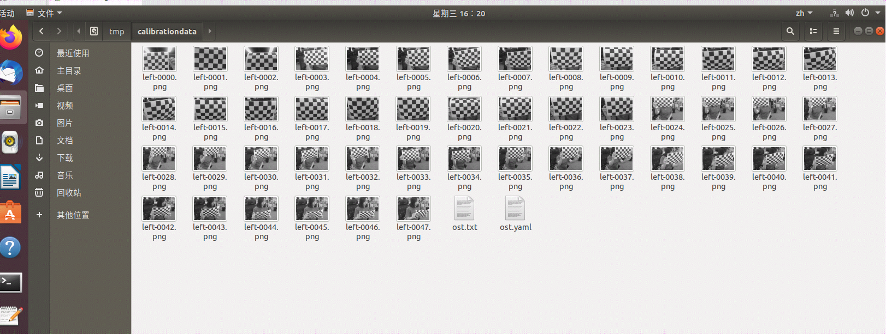

 重新启动摄像头节点后，运行下面命令可以查到到校准参数已经更新，如下图是校准信息

   ```bash
roslaunch usb_cam usb_cam-test.launch
rostopic echo /usb_cam/camera_info
   ```

   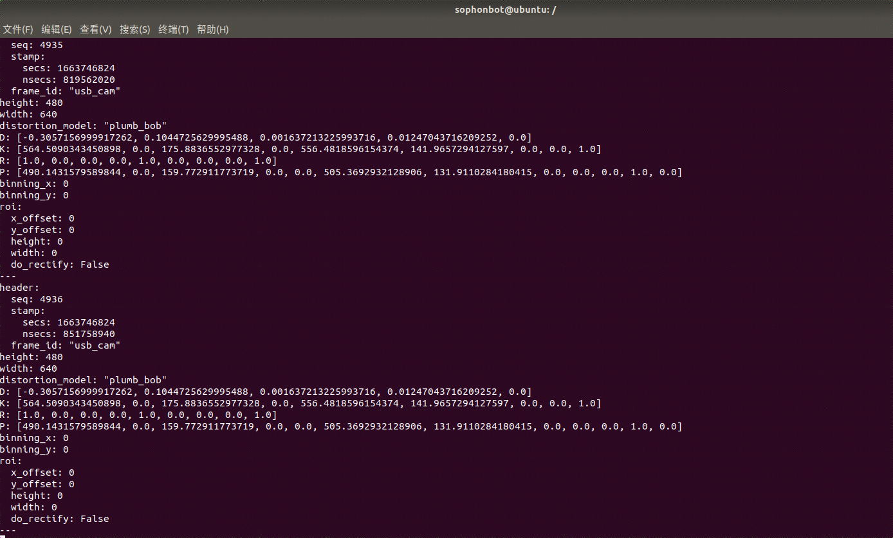

