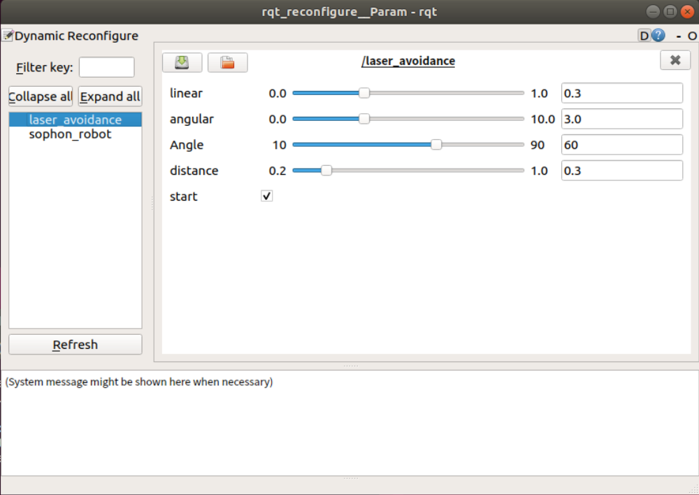
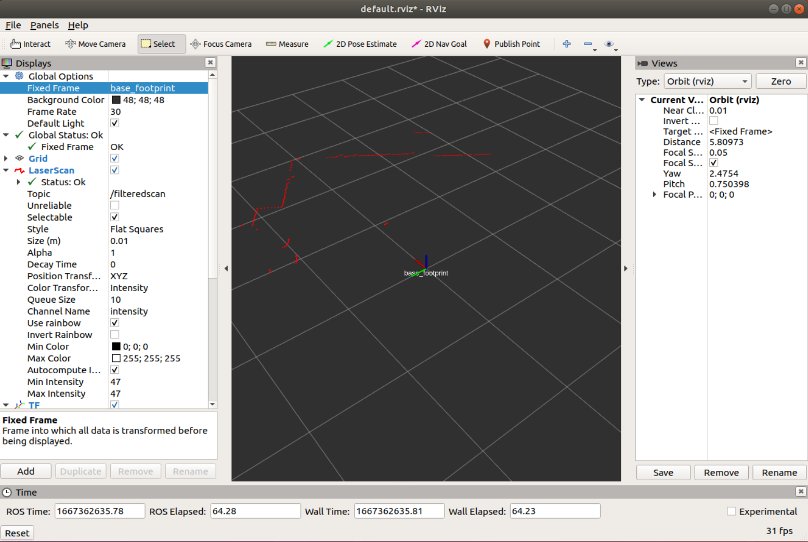
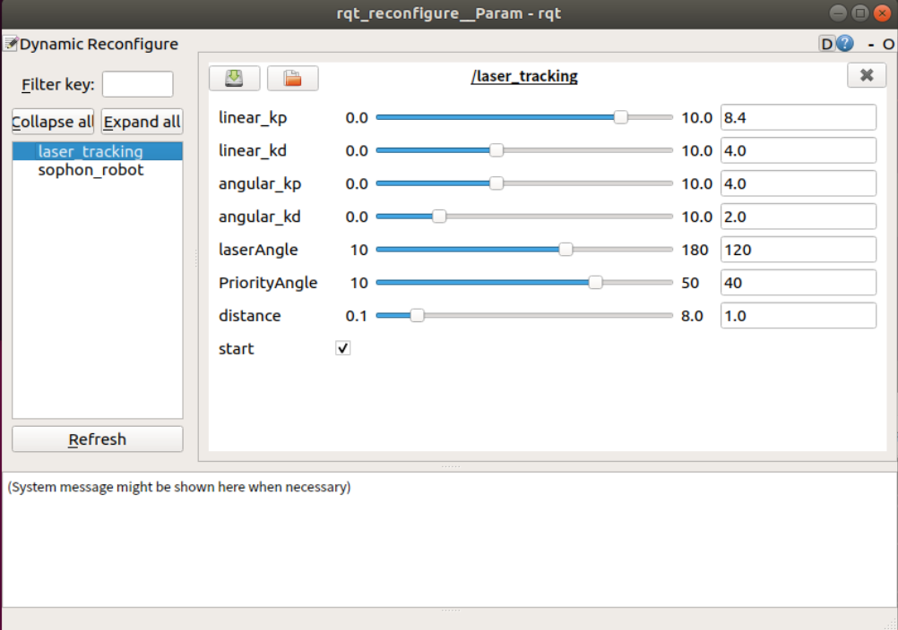

## 1 雷达数据过滤
在机器人端输入以下命令启动雷达数据过滤节点
```
roslaunch sophon_robot laser_filter.launch
```
在虚拟机启动图形化界面，发现只能观察到部分数据，是因为剩余的部分被过滤掉了
```
rosrun rviz rviz
```


在虚拟机启动动态参数调节界面
```
rosrun rqt_reconfigure rqt_reconfigure 
```
laserAngle：机器人前面探测的角度  
distance：机器人可以探测的距离  


### 1.1 具体代码实现以及注释
```bash
def callback(self,data):
        newdata = data
        
        #Convert tuple data to list
        newdata.ranges = list(data.ranges)
        newdata.intensities = list(data.intensities)
        #data len
        length = len(data.ranges)
        #Angle range
        Index = int(self.Angle/2*length/360)

        #Distance filtering
        for i in range(length):
            if(newdata.ranges[i] > self.Dist):
                newdata.ranges[i] = 0
                newdata.intensities[i] = 0
                
        #Angle filtering
        for i in range(Index,length -Index):
            newdata.ranges[i] = 0
            newdata.intensities[i] = 0
            
        self.pub.publish(newdata)
```

## 2 雷达避障
在机器人端输入以下命令启动雷达避障节点，启动后机器人会自动向前运动并且避开障碍物
```
roslaunch sophon_robot laser_avoidance.launch
```
在虚拟机启动动态参数调节界面
```
rosrun rqt_reconfigure rqt_reconfigure 
```
linear：机器人前进的线速度  
angular：机器人转向的角速度  
Angle：机器人的探测角度范围  
Distance：障碍物距离，距离小于此值则认为遇到障碍物并转向  
start：机器人避障开关  


### 2.1 具体代码实现以及注释
首先根据订阅的雷达扫描节点的信息判断小车距离左、中、右障碍物的距离是否达到阈值，如果小于阈值则认为该方向需要避障。
```bash
newdata = data

#Convert tuple data to list
newdata.ranges = list(data.ranges)
newdata.intensities = list(data.intensities)
#data len
length = len(data.ranges)

Index = int(self.Angle/2*length/360)

#middle 
if (min(data.ranges[0:Index]) < self.Dist or min(data.ranges[(length - Index):]) < self.Dist):
    self.warning[1] = 1
else:
    self.warning[1] = 0

#left 
if min(data.ranges[int(length/4)-Index:int(length/4)+Index]) < self.Dist:
    self.warning[0] = 1
else:
    self.warning[0] = 0
    
#right 
if min(data.ranges[int(length*3/4)-Index:int(length*3/4)+Index]) < self.Dist:
    self.warning[2] = 1
else:
    self.warning[2] = 0
```
如果需要避障，则给小车一个相应的角速度躲开障碍物
```bash
if(self.start):
    if(self.warning[1] == 0):    #forward
        self.cmd.linear.x = self.linear
        self.cmd.angular.z = 0
        self.cmd_pub.publish(self.cmd)
    elif(self.warning[0] == 0):  #turn left
        self.cmd.linear.x = 0
        self.cmd.angular.z = self.angular
        self.cmd_pub.publish(self.cmd)
    elif(self.warning[2] == 0):  #turn right
        self.cmd.linear.x = 0
        self.cmd.angular.z = - self.angular
        self.cmd_pub.publish(self.cmd)
    else:                        #turn left or turn right,random
        if(random.randint(0,1) == 1):
            self.cmd.angular.z = self.angular
        else:
            self.cmd.angular.z = -self.angular
            
        self.cmd.linear.x = 0
        self.cmd_pub.publish(self.cmd) #publish cmd_vel topic
```
## 3 雷达警卫
在机器人端输入以下命令启动雷达警卫节点，启动后会控制机器人转向距离最近的点
```
roslaunch sophon_robot laser_warning.launch
```
在虚拟机启动图形化界面，查看机器人是否面向最近的点
```
rosrun rviz rviz
```


在虚拟机启动动态参数调节界面
```
rosrun rqt_reconfigure rqt_reconfigure 
```
kp,kd:PID参数  
laserAngle:机器人的探测角度范围  
distance:探测距离  
start:机器人启动开关  


### 3.1 具体代码实现以及注释
寻找距离小车最近的点以及索引，控制小车转向这个点
```bash
newdata = data
#Convert tuple data to list
newdata.ranges = list(data.ranges)
newdata.intensities = list(data.intensities)
#data len
length = len(data.ranges)
#Angle range
Index = int(self.Angle/2*length/360)

minDist = min(data.ranges[0:Index])
tmp = min(data.ranges[(length - Index):])

# Find the minimum distance and index
if(minDist < tmp):
    minIndex = data.ranges[0:Index].index(minDist)
else:
    minDist = tmp
    minIndex = data.ranges[(length - Index):].index(minDist)
    minIndex = minIndex + length - Index

for i in range(Index,length -Index):
    newdata.ranges[i] = 0
    newdata.intensities[i] = 0 
    
self.pub.publish(newdata)

if(newdata.ranges[minIndex] < self.Dist):
    if(minIndex < length/2):err = minIndex
    else:err = minIndex - length    
    
    self.cmd.angular.z = (self.kp * err + self.kd * (err - self.last_err)) * 0.05
    self.last_err = err

    if(self.cmd.angular.z > self.Max):self.cmd.angular.z = self.Max
    elif(self.cmd.angular.z < -self.Max):self.cmd.angular.z = -self.Max
    if(self.start):
        self.cmd_pub.publish(self.cmd)
    else:
        self.cmd_pub.publish(Twist())
else:
    self.cmd_pub.publish(Twist())
```
## 4 雷达跟随
在机器人端输入以下命令启动雷达跟随节点，启动后会控制机器人跟随距离最近的点移动
```
roslaunch sophon_robot laser_tracking.launch
```
在虚拟机启动图形化界面，查看机器人是否跟随最近的点
```
rosrun rviz rviz
```


在虚拟机启动动态参数调节界面
```
rosrun rqt_reconfigure rqt_reconfigure 
```
linear_kp,linear_kd:线速度PID参数  
angular_kp,angular_kd:角速度PID参数  
laserAngle:机器人的探测角度范围  
PriorityAngle:设置机器人的优先探测角度范围  
distance:探测距离  
start:机器人启动开关  


### 4.1 具体代码实现以及注释
```bash
newdata = data

#Convert tuple data to list
newdata.ranges = list(data.ranges)
newdata.intensities = list(data.intensities)
#data len
length = len(data.ranges)
Index = int(self.Angle/2*length/360)                        #laser Angle range
PIndex = int(self.Priority_angle/2*length/360)              #Priority Angle range
if(PIndex >= Index):PIndex = Index - 1

#Find the minimum distance and index 
PminDist = min(data.ranges[0:PIndex])
tmp = min(data.ranges[(length - PIndex):])

if(PminDist < tmp):
    PminIndex = data.ranges[0:PIndex].index(PminDist)
else:
    PminDist = tmp
    PminIndex = data.ranges[(length - PIndex):].index(PminDist)
    PminIndex = PminIndex + length - PIndex

minDist = min(data.ranges[PIndex:Index])
tmp = min(data.ranges[(length - Index):(length - PIndex)])

if(minDist < tmp):
    minIndex = data.ranges[PIndex:Index].index(minDist)
    minIndex = minIndex + PIndex
else:
    minDist = tmp
    minIndex = data.ranges[(length - Index):(length - PIndex)].index(minDist)
    minIndex = minIndex + length - Index

if ((PminDist - minDist) < 0.3):
    minDist  = PminDist
    minIndex = PminIndex

if(newdata.ranges[minIndex] < self.Dist):
    #Follow distance
    linear_err = newdata.ranges[minIndex] - 0.4                
    self.cmd.linear.x = (self.linear_kp * linear_err + self.linear_kd * (linear_err - self.last_linear_err))
    self.last_linear_err = linear_err
    #Limit maximum output
    if(self.cmd.linear.x > self.linear_Max):self.cmd.linear.x = self.linear_Max
    elif(self.cmd.linear.x < -self.linear_Max):self.cmd.linear.x = -self.linear_Max

    if (self.cmd.linear.x < 0) and (min(data.ranges[int(length/2)-Index:int(length/2)+Index]) < 0.4):
        self.cmd.linear.x = 0

    if(minIndex < length/2):angular_err = minIndex
    else:angular_err = minIndex - length    
    self.cmd.angular.z = (self.angular_kp * angular_err + self.angular_kd * (angular_err - self.last_angular_err)) * 0.05
    self.last_angular_err = angular_err
    #Limit maximum output
    if(self.cmd.angular.z > self.angular_Max):self.cmd.angular.z = self.angular_Max
    elif(self.cmd.angular.z < -self.angular_Max):self.cmd.angular.z = -self.angular_Max

    if(self.start):
        self.cmd_pub.publish(self.cmd)
    else:
        self.cmd_pub.publish(Twist())
else:
    self.cmd_pub.publish(Twist())
    
#Angle filtering
for i in range(Index,length -Index):
    newdata.ranges[i] = 0
    newdata.intensities[i] = 0
    
self.pub.publish(newdata)
```

